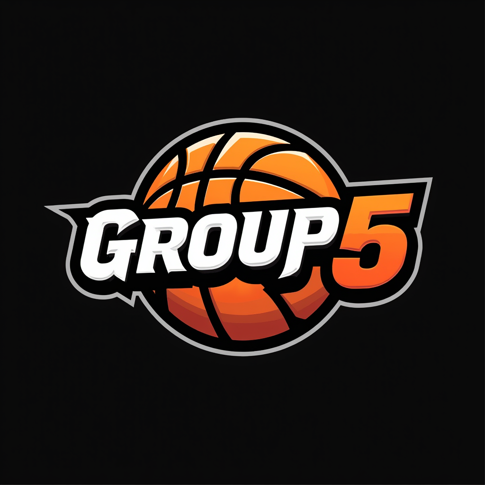

# Team Charter

## Introduction

This Team Charter outlines the purpose, objectives, roles, responsibilities, and operating guidelines for our team. It serves as a roadmap to ensure alignment and effective collaboration throughout the project.

## Team Information

- **Team Name:** **`Group5`**
- **Team Members:**
  1. Anson He
  2. Norman Yuan
  3. Huijia Wang
  4. Yuming Sun

## Team Purpose and Objectives

Our team is dedicated to achieving the following purpose and objectives:

1. **Purpose:** Our team focuses on delivering a full-stack solution and ensuring its successful implementation based on the requirements of the BC Cancer project. We are committed to meeting the project's specific needs while maintaining high standards of quality and functionality, utilizing industry-standard practices, tools, and frameworks.
  
2. **Objectives:**

   - Deliver a fully functional product that meets the client's needs.
   - Ensure client satisfaction through effective communication and timely delivery.
   - Foster positive team dynamics and collaboration.
   - Select and effectively utilize appropriate tech stacks for the project.

## Roles and Responsibilities

To leverage individual strengths and ensure accountability, we have assigned the following roles and responsibilities:

1. **Role:** `Anson He` - **PM/SDE**

**Responsibilities:**

- Utilize and refine product requirements.
- Frontend development

2. **Role:** `Norman Yuan` - **SDE**

**Responsibilities:**

- Backend development

3. **Role:** `Huijia Wang` - **SDE**

**Responsibilities:**

- Backend development

3. **Role:** `Yuming Sun` - **TBC**

**Responsibilities:**

- TBC

## Team Values and Norms

We commit to upholding the following values and norms to foster a positive and productive team environment:

1. **`Respect`:** We believe in allowing each team member to contribute in areas where they excel and enjoy working. By doing so, we respect individual strengths and interests, ensuring that everyone is motivated and engaged.

2. **`Trust`:** We maintain trust by ensuring that when a task is assigned, we have confidence in each team member's ability to complete it thoroughly and effectively.

3. **`Punctuality`:** As a team, we commit to attending all team meetings. Each meeting will be scheduled with reminders in advance, and we will make punctuality a priority to keep our collaboration seamless.

4. **`Commitment to Quality`:** We hold ourselves to high standards by following production-level practices in all aspects of our work, ensuring that the end product is both functional and of high quality.

## Decision-Making Process

Decisions within the team will be made using the following process:

1. **Consensus:** Our team will primarily rely on consensus for decision-making, as all team members bring professional working experience. This approach ensures that each member’s input is valued and respected, promoting collaboration and mutual agreement.

2. **Majority Vote:** In cases where consensus cannot be reached within a reasonable timeframe, a majority vote will be used to make the final decision. This ensures progress without sacrificing team collaboration.

3. **Designated Decision-Maker:** For decisions related to specific areas, designated roles will have decision-making authority. For instance, Anson He will have the final say on product management and frontend design, while Norman Yuan and Huijia Wang will make decisions related to backend development.

## Communication Plan

Effective communication is crucial for our success. Our communication plan includes:

1. **Tools:**

   - `WeChat`: For daily discussions and quick updates.
   - `Email`: To share important milestones, decisions, and formal documentation.
   - `Microsoft Teams:` For virtual meetings, demos, and showcasing progress.

2. **Frequency:**

   - WeChat: **Daily** discussions to keep the team aligned.
   - Email: Used for milestone updates as needed.
   - Teams Meetings: Scheduled for key checkpoints(weekly) such as demos and progress showcases.

3. **Reporting:** Progress will be reported during virtual meetings, and milestone updates will be shared via email to ensure all team members are informed and up to date.

## Conflict Resolution Mechanisms

Conflicts will be addressed promptly using the following mechanisms:

1. **Open Discussion:** Team members are encouraged to openly discuss issues as they arise in a respectful and constructive manner, ensuring all perspectives are heard.

2. **Mediation:** If a conflict cannot be resolved through open discussion, a neutral team member will act as a mediator to help facilitate a fair and balanced resolution.

3. **Escalation:** For conflicts that remain unresolved after mediation, the issue will be escalated to the scrum master for final resolution.

## Performance Expectations

We have set the following performance expectations to maintain high standards:

1. **Metrics:**

   - Task completion according to the project timeline.
   - Use of modern frameworks and best practices to ensure high performance.

2. **Goals:**

   - Implement a robust, high-performing solution using modern frameworks.
   - Ensure seamless interactions across all components to deliver a smooth user experience.

3. **Feedback:**
   - Feedback will be provided regularly by the Scrum Master(TA), with additional input from PM Anson He.
   - Improvements based on feedback will be implemented promptly, followed by reevaluation to ensure continuous progress.

## Meeting Schedules and Agendas

Regular meetings will be scheduled as follows:

1. **Frequency:**

   - WeChat: Used **daily** for quick discussions and updates.
   - Teams Meetings: Held **weekly** to align the team and review progress.
   - Email: Used for milestone updates and formal communications.

2. **Agenda:**

   - Agendas will follow a **standard Scrum format**, including progress updates, upcoming tasks, and any blockers. Meetings will typically last 30-45 minutes.

3. **Minutes:**

   - Meeting minutes will be recorded and distributed via email after each Teams meeting to ensure all action items and decisions are tracked.

## Ensuring Adherence to the Charter

To ensure we adhere to this charter, we will:

1. **Regular Reviews:** The charter will be reviewed biweekly or immediately if urgent issues arise to ensure it remains relevant and effective.

2. **Accountability:** Each team member is responsible for upholding the charter. Regular progress checks and feedback will ensure accountability, with team members supporting one another to meet expectations.

3. **Flexibility:** While the charter provides structure, it will be adhered to strictly. Adjustments will only be made when absolutely necessary, following team discussion and agreement.

4. **Leadership:** Anson He, acting as the Product Manager, will oversee adherence to the charter and ensure that team members follow the guidelines and values outlined.

## Conclusion

This team charter is essential for our collaboration and success. By following the guidelines and commitments outlined above, we can work effectively towards our shared objectives.
